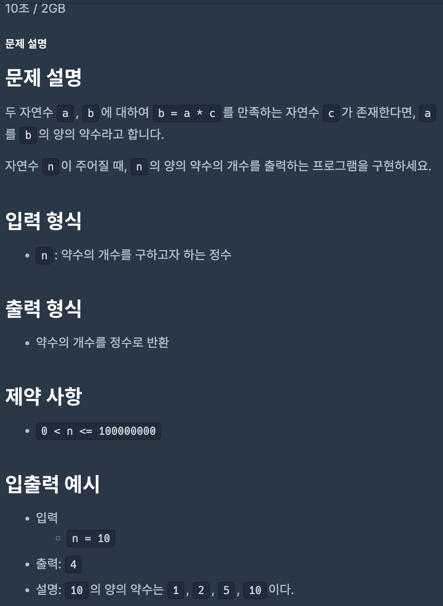
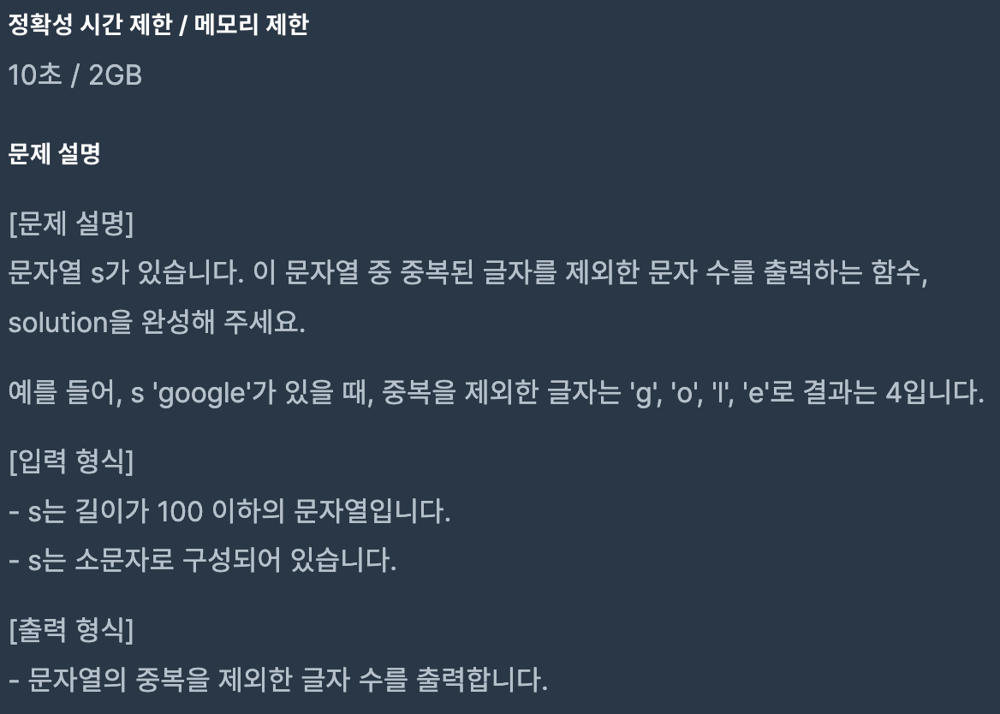
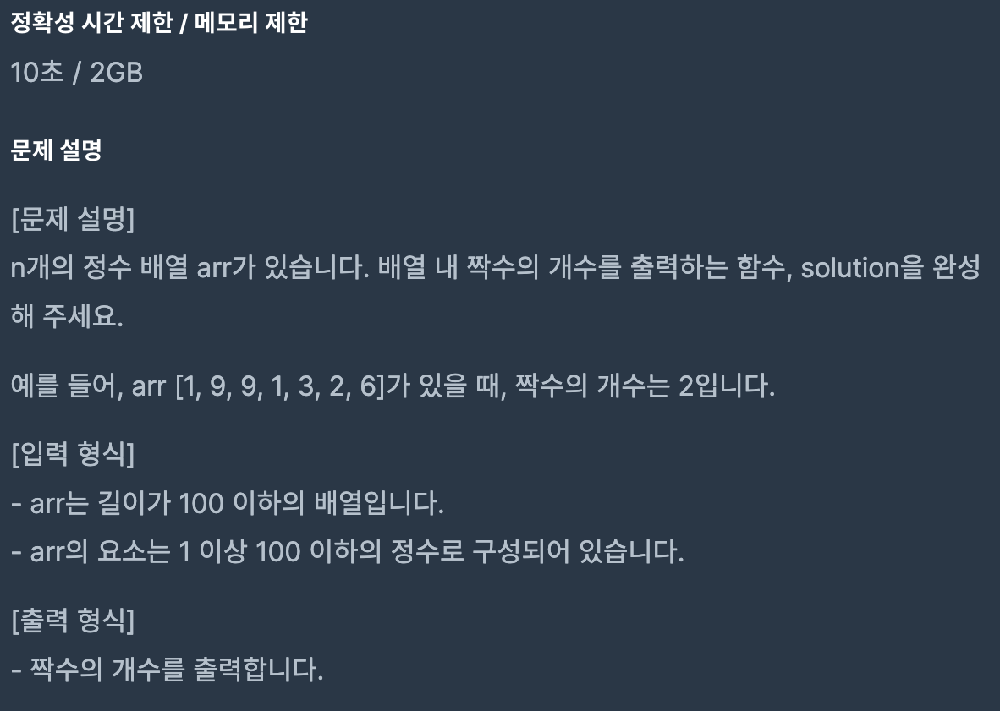
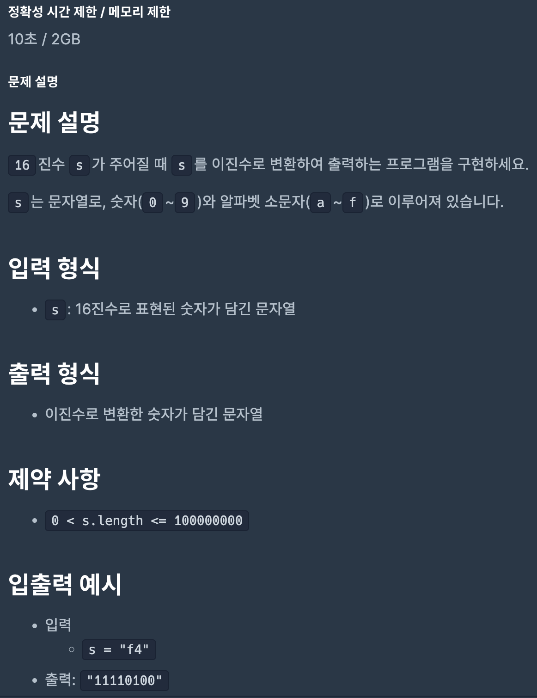
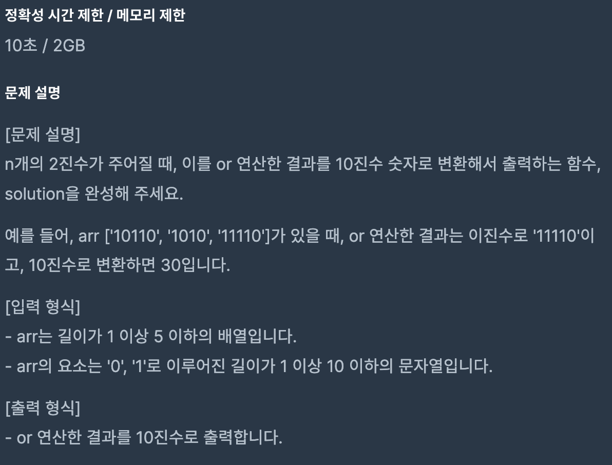

# Coding Test 03

<br>

## Problem 1



### Solution

``` javascript
function solution(n) {
    let answer = 0;
    for (let i = 1; i * i <= n; i++) {
        if (n % i === 0) {
            i * i === n ? answer++ : answer += 2;
        }
    }
    return answer;
}
```

[Link to my JavaScript solution file](./T03P1.js)

<br>

## Problem 2



### Solution

``` javascript
function anotherSolution(s) {
    return new Set(s).size;
}
```

[Link to my JavaScript solution file](./T03P2.js)

<br>

## Problem 3



### Solution

``` javascript
function solution(arr) {
    let answer = arr.filter(n => n % 2 === 0);
    return answer.length;
}
```

[Link to my JavaScript solution file](./T03P3.js)

<br>

## Problem 4



### Solution

``` javascript
function solution(s) {
    return parseInt(s, 16).toString(2);
}
```

[Link to my JavaScript solution file](./T03P4.js)

<br>

## Problem 5



### Solution

``` javascript
function solution(arr) {
    let answer = 0;
    arr.forEach(s => { answer |= parseInt(s, 2); });
    return answer;
}
```

[Link to my JavaScript solution file](./T03P5.js)

<br>
