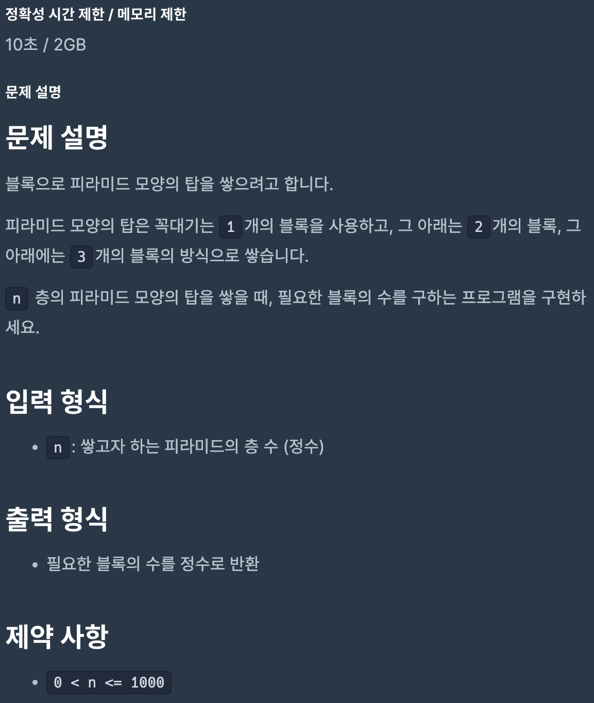
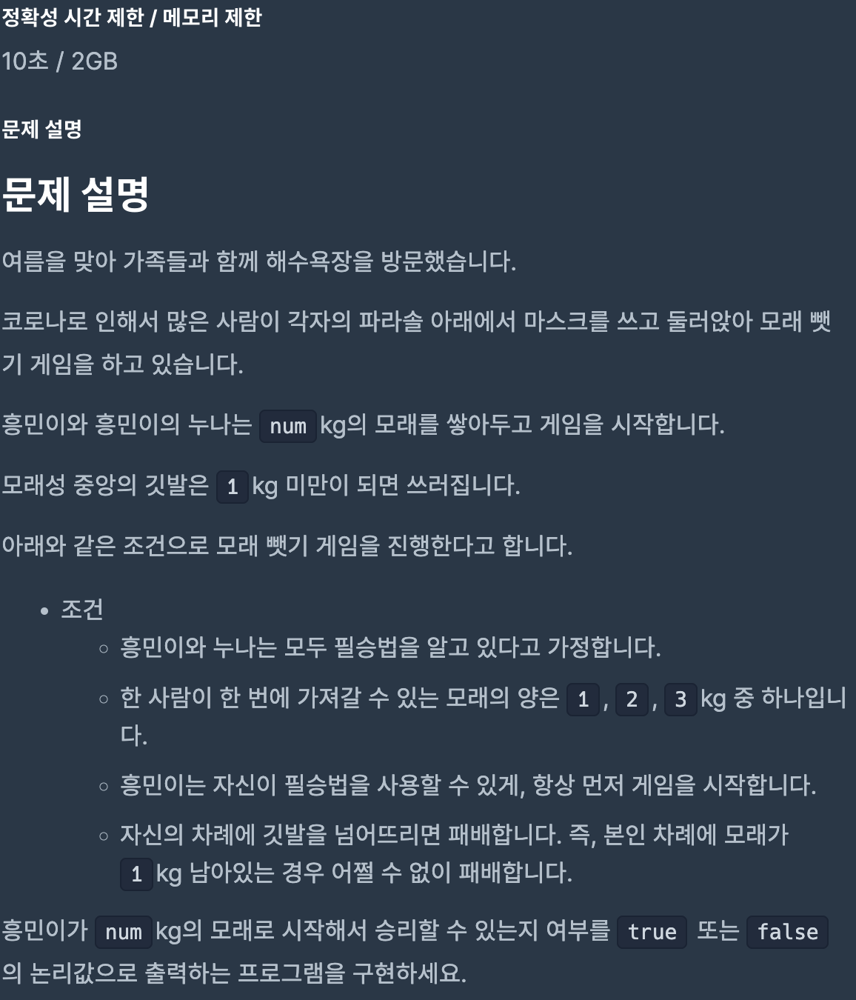
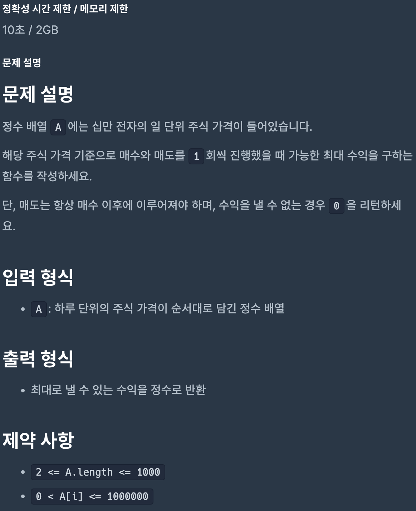
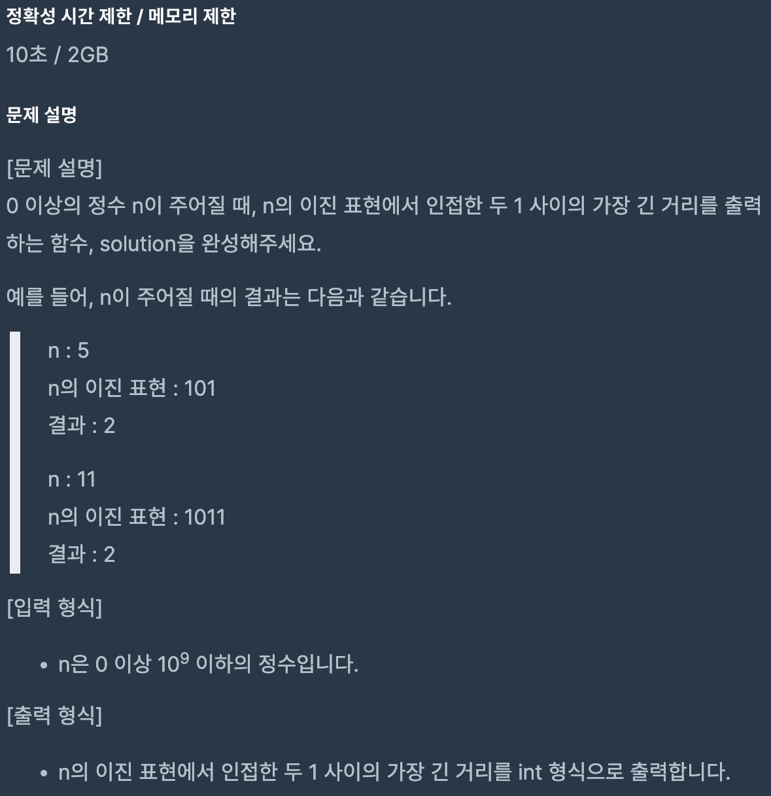
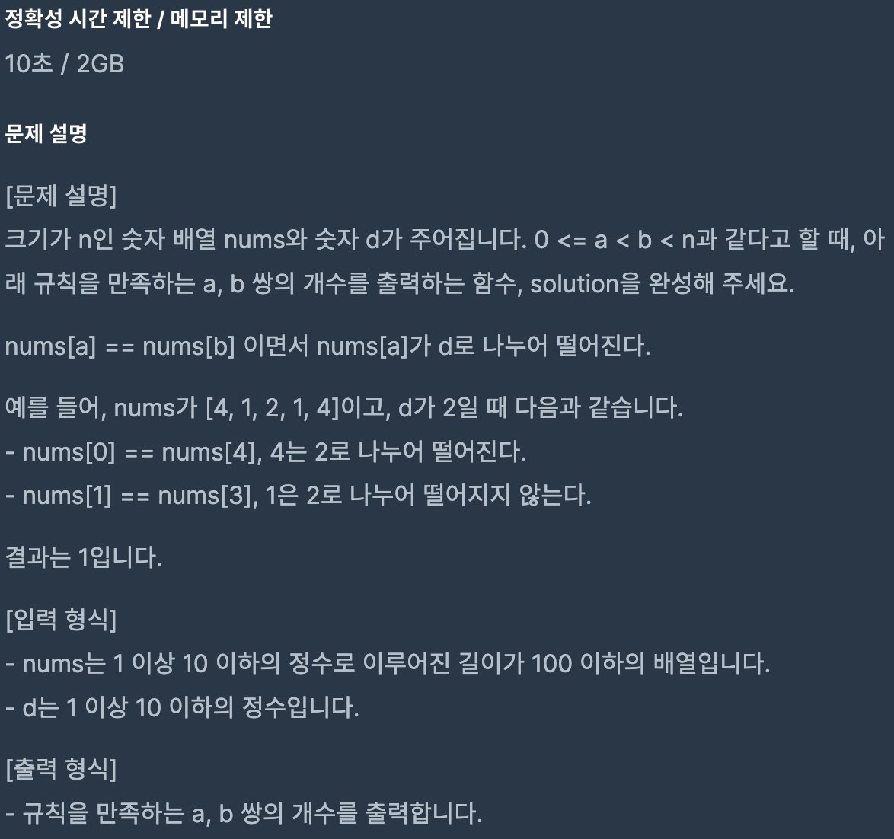

# Coding Test 04

 

## Problem 1

### Solution

[Link to my JavaScript solution file](./T04P1.js)

 

## Problem 2

### Solution

[Link to my JavaScript solution file](./T04P2.js)

 

## Problem 3

### Solution

[Link to my JavaScript solution file](./T04P3.js)

 

## Problem 4

### Solution

[Link to my JavaScript solution file](./T04P4.js)

 

## Problem 5

### Solution

[Link to my JavaScript solution file](./T04P5.js)

 
