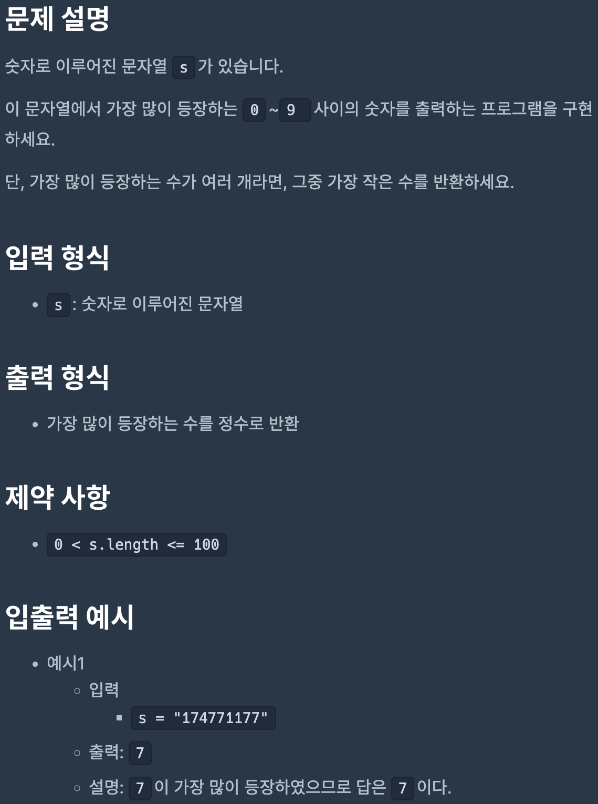
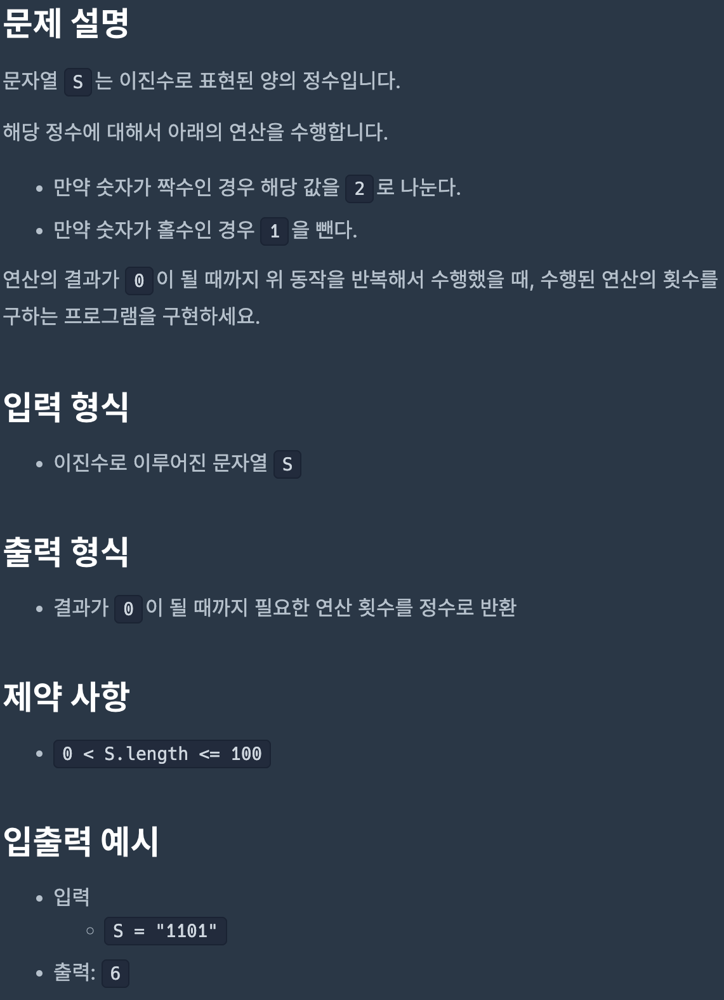
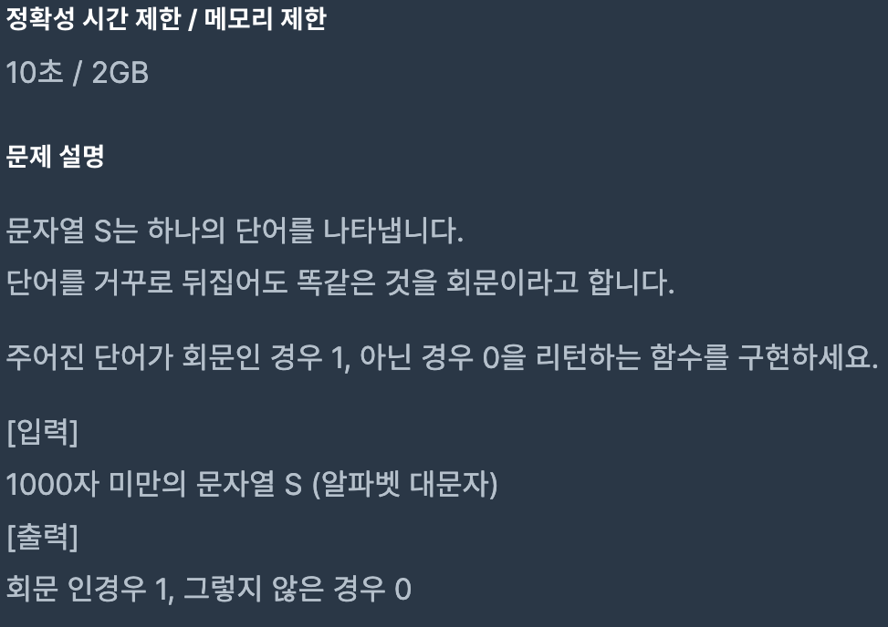
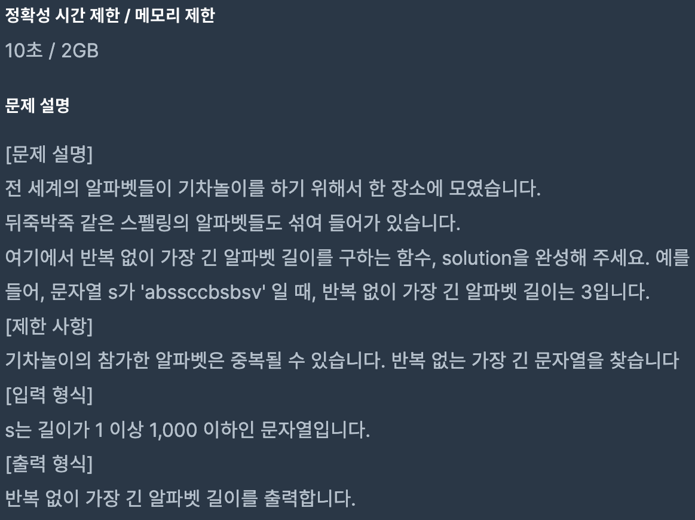
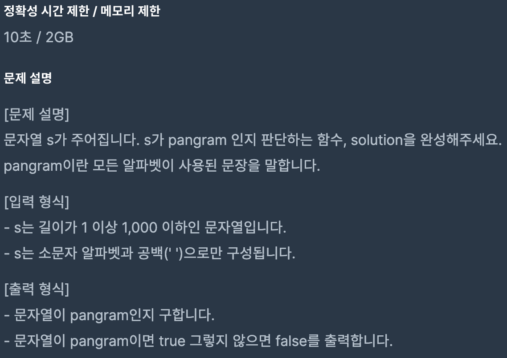

# Coding Test 05

<br>

## Problem 1



### Solution

``` javascript
function solution(s) {
    const str = s.split('').sort();
    const n = str.map(e => Number(e));

    let max = -1;
    let answer;

    for (let i = 0; i < 10; i++) {
        if (!n.includes(i)) continue;

        const count = n.lastIndexOf(i) - n.indexOf(i);

        if (count > max) {
            max = count;
            answer = i;
        }
    }

    return answer;
}
```

[Link to my JavaScript solution file](./T05P1.js)

<br>

## Problem 2



### Solution

``` javascript
function solution(S) {
    let n = parseInt(S, 2);
    let count = 0;

    while (n !== 0) {
        n % 2 === 0 ? n /= 2 : n -= 1;
        count++;
    }

    return count;
}
```

[Link to my JavaScript solution file](./T05P2.js)

<br>

## Problem 3



### Solution

``` javascript
function solution(S) {
    return Number(S === S.split('').reverse().join(''));
}
```

[Link to my JavaScript solution file](./T05P3.js)

<br>

## Problem 4



### Solution

``` javascript
function solution(s) {
    let arr = [];
    let longest = 1;

    for (const c of s.toLowerCase()) {
        if (arr.length > longest) longest = arr.length;
        arr.includes(c) ? arr = [c] : arr.push(c);
    }
    
    return longest;
}
```

[Link to my JavaScript solution file](./T05P4.js)

<br>

## Problem 5



### Solution

``` javascript
function solution(s) {
    const str = s.toLowerCase().split('');
    const alphabet = 'abcdefghijklmnopqrstuvwxyz'.split('');

    for (let i = 0; i < alphabet.length; i++) {
        if (str.indexOf(alphabet[i]) === -1) return false;
    }
    
    return true;
}
```

[Link to my JavaScript solution file](./T05P5.js)

<br>
