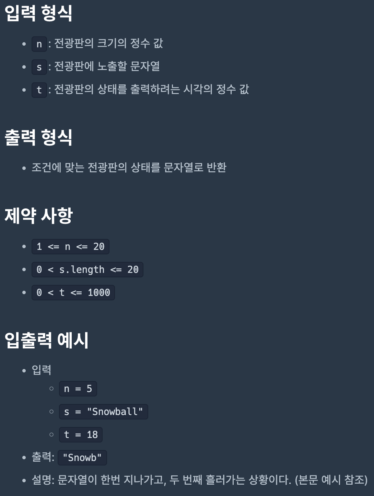
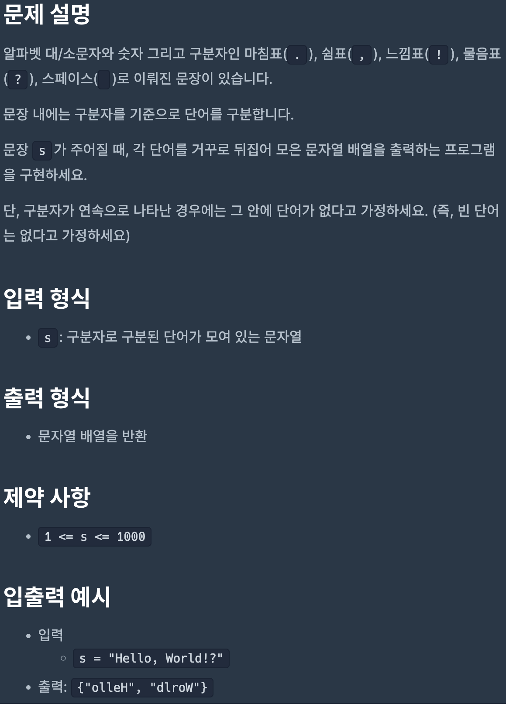
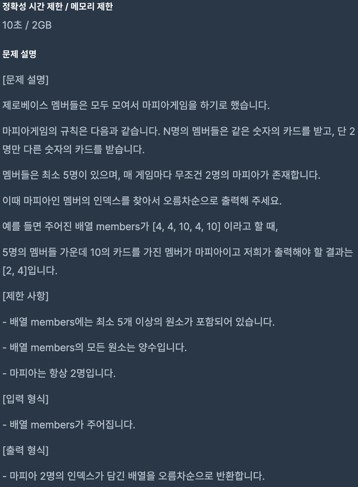
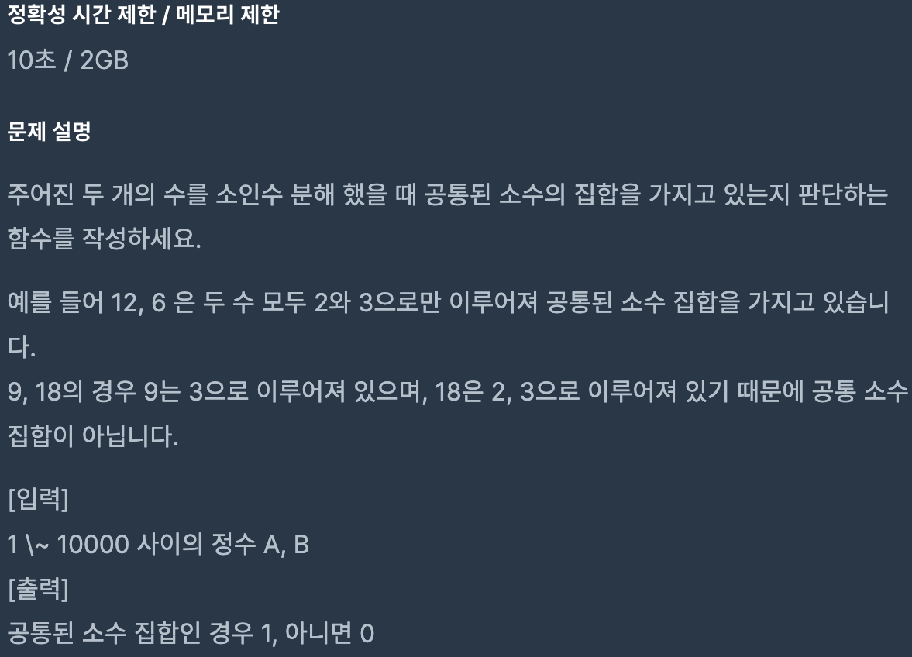

# Coding Test 06

<br>

## Problem 1




### Solution

``` javascript
function solution(n, s, t) {
    let str = '', result = '';

    for (let i = 0; i < n; i++) {
        str += '.';
    }
    str += s;
    str += str;

    const idx = t % (str.length / 2);
    for (let i = idx; i < idx + n; i++) {
        result += str[i];
    }

    return result;
}
```

[Link to my JavaScript solution file](./T06P1.js)

<br>

## Problem 2



### Solution

``` javascript
function solution(s) {
    const strArr = s.split('.').join(' ').split(',').join(' ').split('!').join(' ').split('?').join(' ').split(' ');
    const reverse = strArr.map(e => e.split('').reverse().join(''));
    const result = reverse.filter(e => e !== '');
    return result;
}
```

[Link to my JavaScript solution file](./T06P2.js)

<br>

## Problem 3


### Solution

``` javascript
function solution(A) {
    const result = A.reduce((acc, cur) => {
        while (cur) {
            let x = cur;
            cur = acc % cur;
            acc = x;
        }
        return acc;
    });

    return result;
}
```

[Link to my JavaScript solution file](./T06P3.js)

<br>

## Problem 4



### Solution

``` javascript
function solution(members) {
    const map = new Map(), result = [];
    let mafia;

    for (let i = 0; i < members.length; i++) {
        map.set(members[i], (map.get(members[i]) || 0) + 1);
    }

    map.forEach((val, key) => { if (val === 2) mafia = key; });

    members.filter((e, i) => { if (e === mafia) result.push(i); });

    return result;
}
```

[Link to my JavaScript solution file](./T06P4.js)

<br>

## Problem 5



### Solution

``` javascript
function solution(A, B) {
    const primeA = primeFactors(A);
    const primeB = primeFactors(B);
    
    for (let i = 0; i < primeA.length; i++) {
        if (primeA[i] !== primeB[i]) return 0;
    }

    return 1;
}

const primeFactors = (n) => {
    const prime = [];
    let f = 2;

    while (n > 1) {
        if (n % f === 0) {
            if (!prime.includes(f)) prime.push(f);
            n /= f;
        } else f++;
    }

    return prime;
}
```

[Link to my JavaScript solution file](./T06P5.js)

<br>
