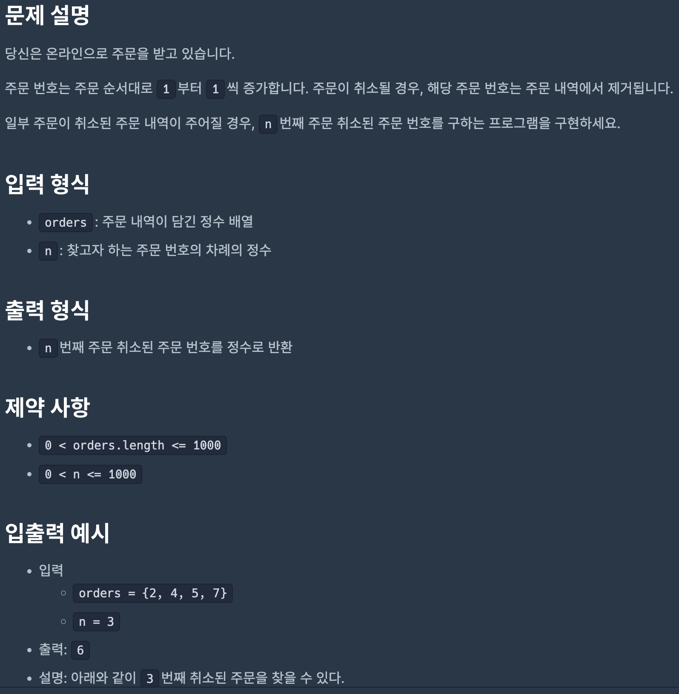
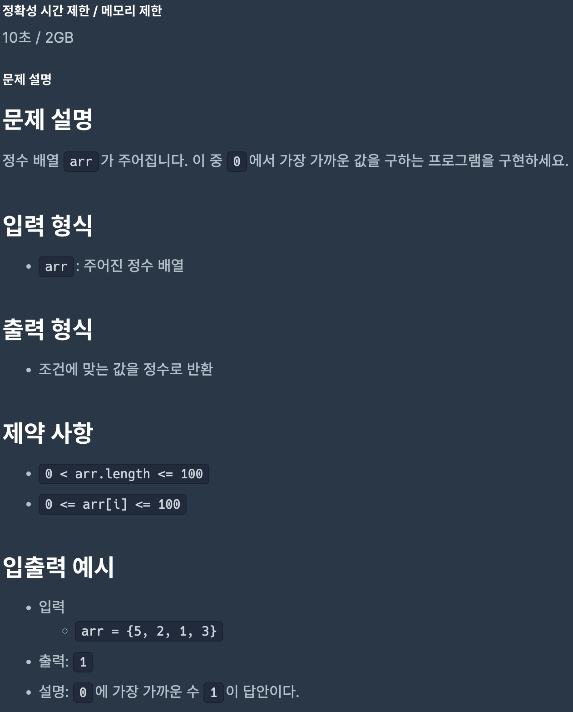
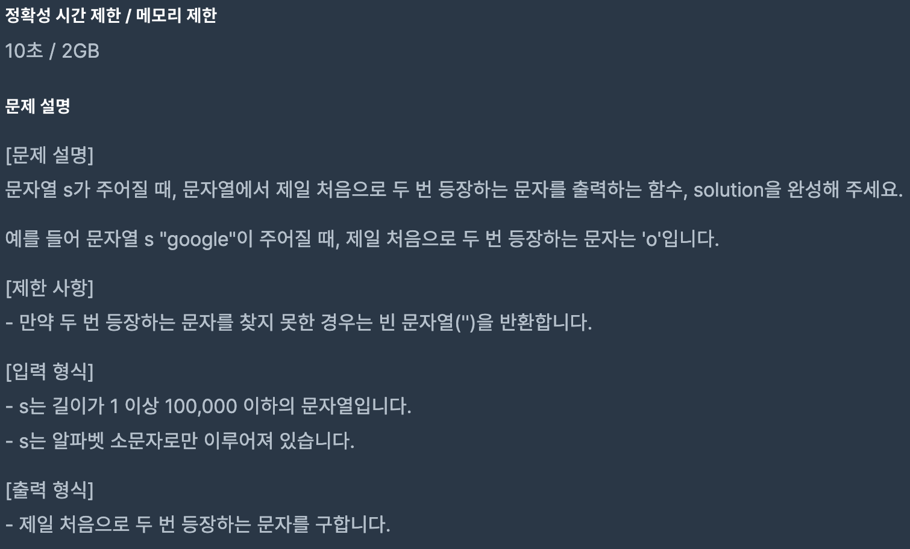
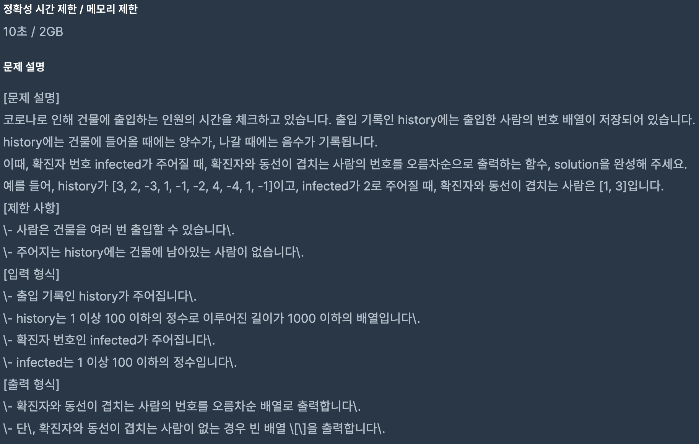
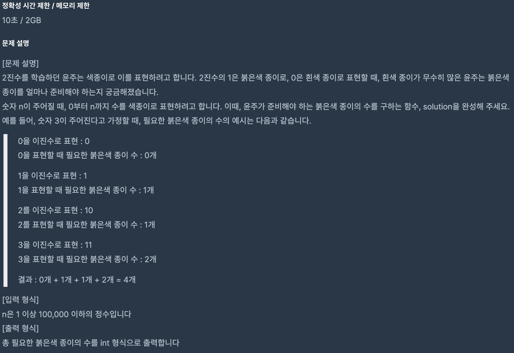

# Coding Test 06

<br>

## Problem 1



### Solution

```javascript
function solution(orders, n) {
    let x = 1,
        i = 0;

    while (n) {
        if (orders[i] !== x) {
            n--;
        }
        if (n === 0) return x;
        x = orders[i] + 1;
        i++;
    }
}
```

[Link to my JavaScript solution file](./T07P1.js)

<br>

## Problem 2



### Solution

```javascript
function solution(arr) {
    arr.sort((x, y) => x - y);
    return arr[0];
}
```

[Link to my JavaScript solution file](./T07P2.js)

<br>

## Problem 3



### Solution

```javascript
function solution(s) {
    const arr = [];

    for (const c of s) {
        if (arr.includes(c)) {
            return c;
        } else {
            arr.push(c);
        }
    }

    return '';
}
```

[Link to my JavaScript solution file](./T07P3.js)

<br>

## Problem 4



### Solution

```javascript
function solution(history, infected) {
    let isInfected = false,
        result = new Set();
    infected = Math.abs(infected);

    for (let n of history) {
        n = Math.abs(n);

        if (isInfected) {
            n === infected ? (isInfected = false) : result.add(n);
        } else if (n === infected) {
            isInfected = true;
        }
    }

    result = result.size > 0 ? Array.from(result).sort((x, y) => x - y) : [];

    return result;
}
```

[Link to my JavaScript solution file](./T07P4.js)

<br>

## Problem 5



### Solution

```javascript
function solution(n) {
    let answer = 0;

    for (let i = 0; i <= n; i++) {
        const arr = i
            .toString(2)
            .split('')
            .filter((e) => e === '1');
        answer += arr.length;
    }

    return answer;
}
```

[Link to my JavaScript solution file](./T07P5.js)

<br>
