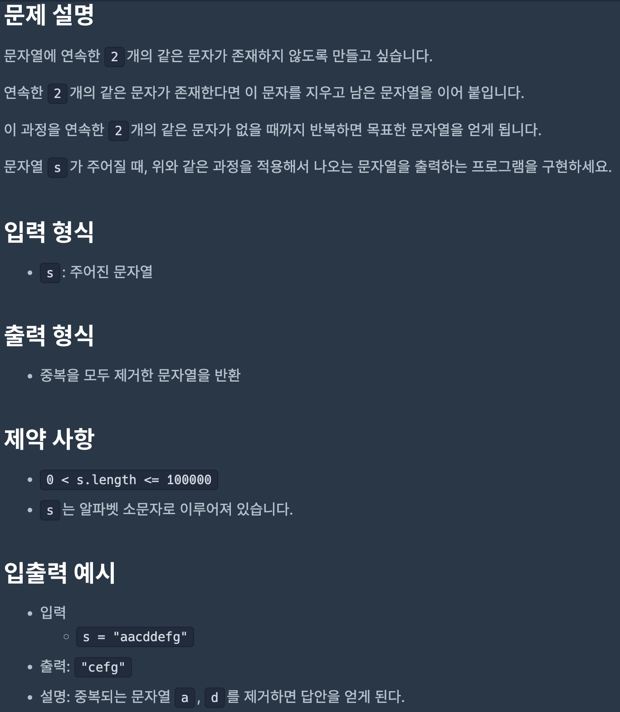
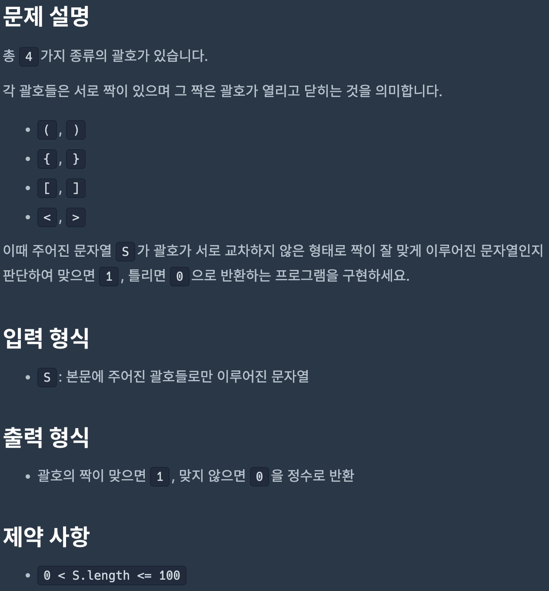
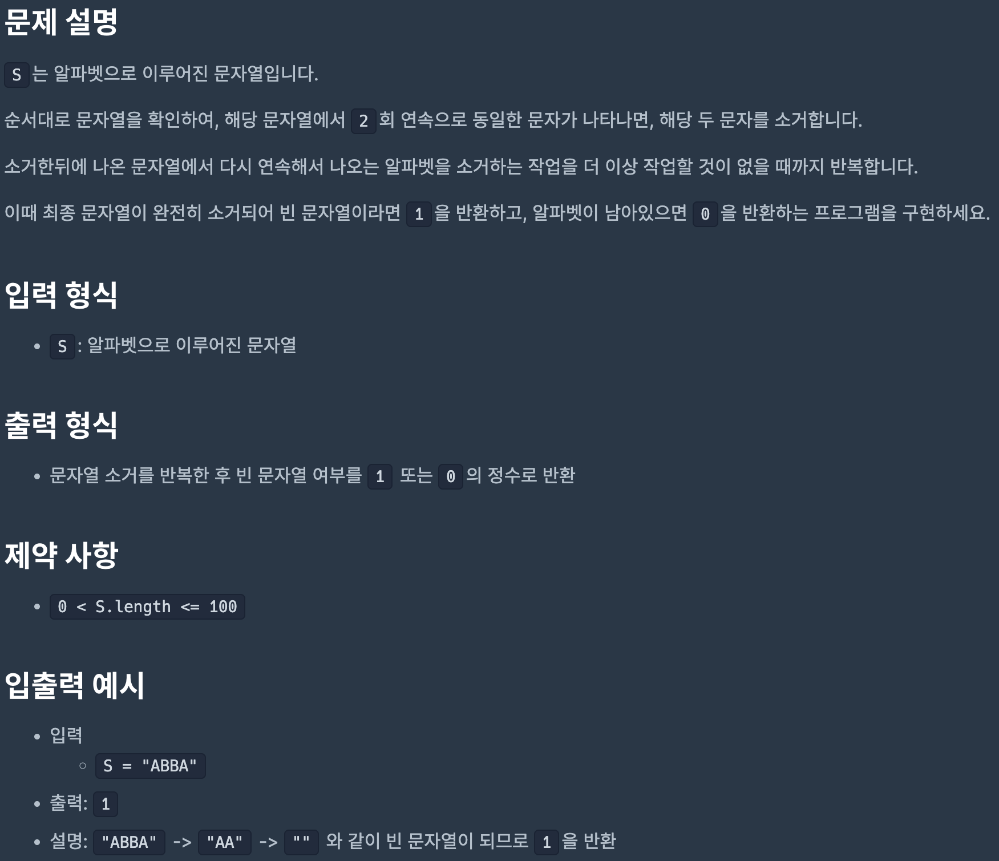
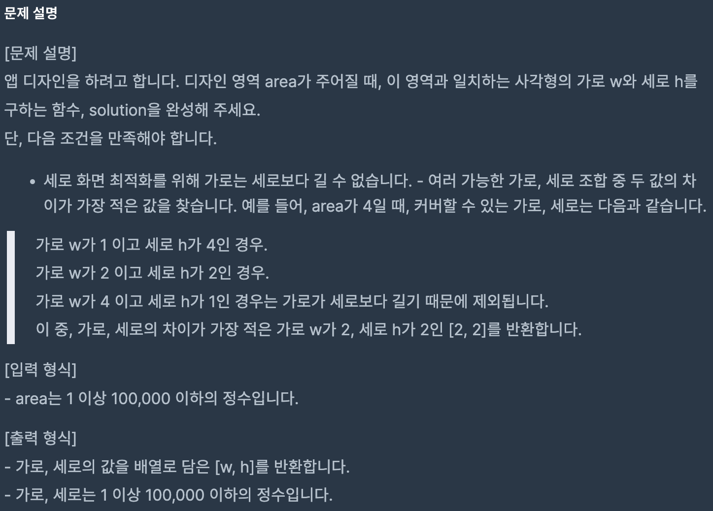
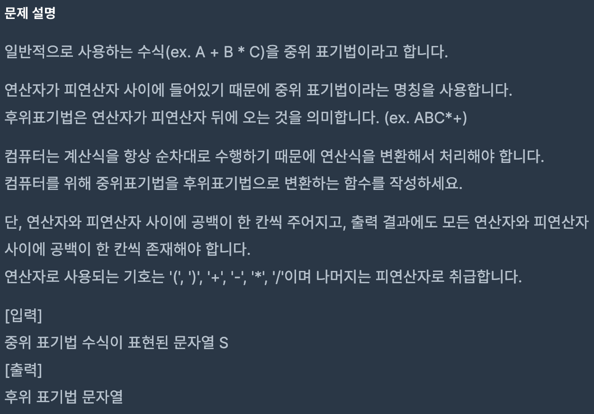

# Coding Test 06

<br>

## Problem 1



### Solution

```javascript
function solution(s) {
    let result = [];

    s.split('').forEach((e) => {
        if (e === result[result.length - 1]) {
            result.pop();
        } else {
            result.push(e);
        }
    });

    return result.join('');
}
```

[Link to my JavaScript solution file](./T08P1.js)

<br>

## Problem 2



### Solution

```javascript
function solution(S) {
    const arr = S.split('');
    const pair = [];

    for (let i = 0; i < arr.length; i++) {
        if (arr[i] === '(') {
            pair.push(')');
        } else if (arr[i] === '{') {
            pair.push('}');
        } else if (arr[i] === '[') {
            pair.push(']');
        } else if (arr[i] === '<') {
            pair.push('>');
        } else if (arr[i] === pair[pair.length - 1]) {
            pair.pop();
        } else {
            return 0;
        }
    }

    return 1;
}
```

[Link to my JavaScript solution file](./T08P2.js)

<br>

## Problem 3



### Solution

```javascript
function solution(S) {
    const arr = [];

    S.split('').forEach((e) => {
        if (e === arr[arr.length - 1]) {
            arr.pop();
        } else {
            arr.push(e);
        }
    });

    if (arr.length > 0) {
        return 0;
    }

    return 1;
}
```

[Link to my JavaScript solution file](./T08P3.js)

<br>

## Problem 4



### Solution

```javascript
function solution(area) {
    let result = [];

    for (let i = 1; i <= Math.sqrt(area); i++) {
        if (Number.isInteger(area / i)) {
            result = [i, area / i];
        } else {
            continue;
        }
    }

    return result;
}
```

[Link to my JavaScript solution file](./T08P4.js)

<br>

## Problem 5



### Solution

```javascript
function solution(S) {
    const stack = [];
    let result = [];

    S.split('').forEach((e) => {
        e = e.trim();

        if (Number(e)) {
            result.push(e);
        } else if (e === '(') {
            stack.push(e);
        } else if (e === ')') {
            while (stack.length !== 0 && stack[stack.length - 1] !== '(') {
                result.push(stack.pop());
            }
            stack.pop();
        } else {
            while (
                stack.length !== 0 &&
                stack[stack.length - 1] !== '(' &&
                getPrecedence(e) <= getPrecedence(stack[stack.length - 1])
            ) {
                result.push(stack.pop());
            }
            stack.push(e);
        }
    });

    while (stack.length !== 0) {
        result.push(stack.pop());
    }

    result = result
        .join('')
        .split('')
        .map((e) => e.trim());

    return result.join(' ');
}

function getPrecedence(operator) {
    if (operator === '+' || operator === '-') {
        return 1;
    } else if (operator === '*' || operator === '/') {
        return 2;
    } else {
        return 0;
    }
}
```

[Link to my JavaScript solution file](./T08P5.js)

<br>
