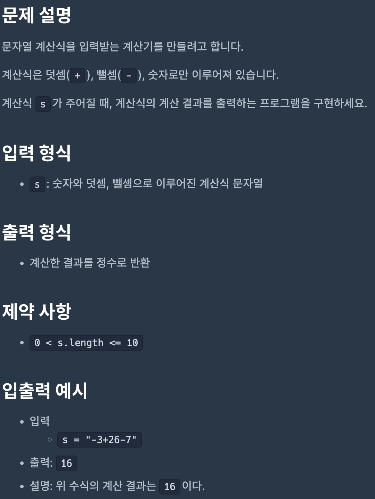
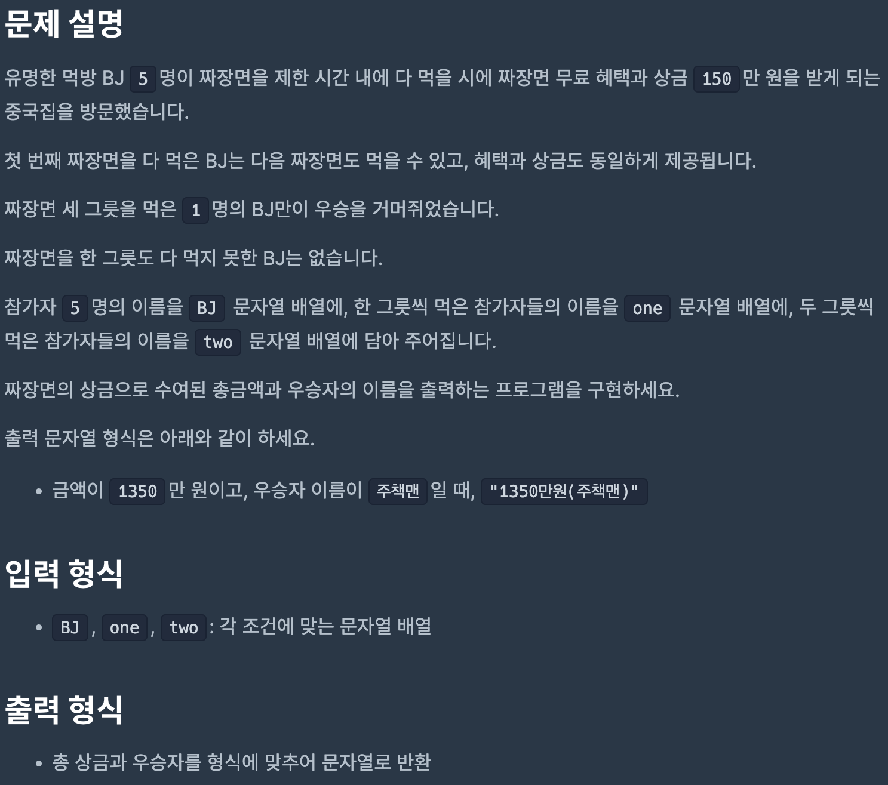
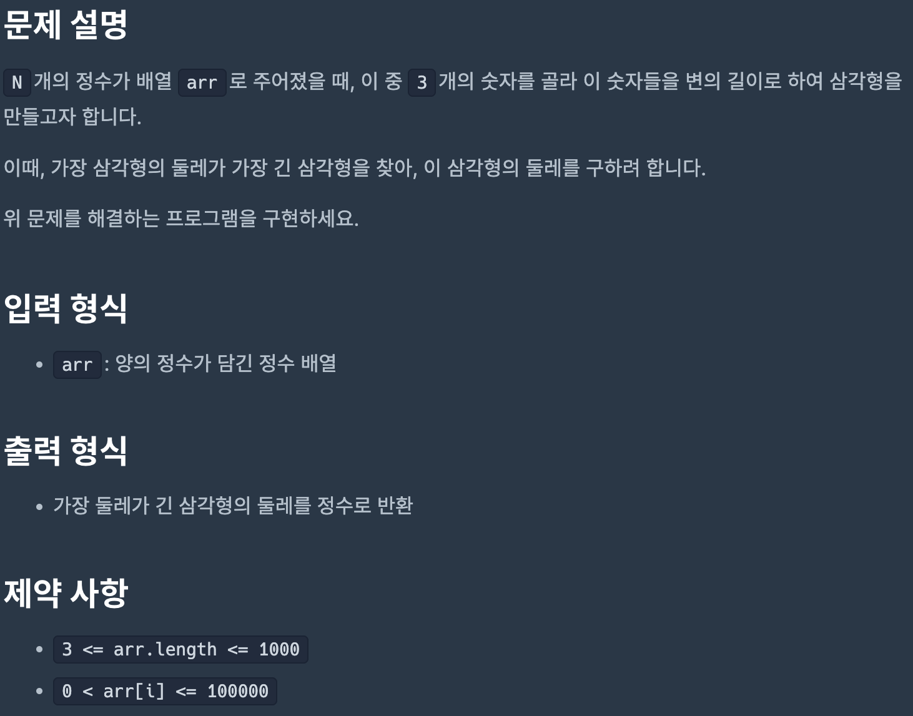
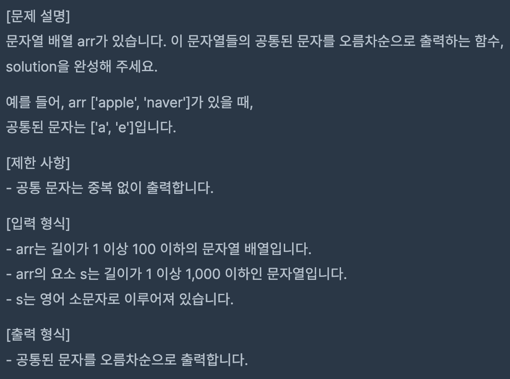

# Coding Test 09

<br>

## Problem 1



### Solution

```javascript
function solution(s) {
    const arr = s.split('');
    let answer = 0,
        add = true,
        number = '';

    const calculate = () => {
        const n = parseInt(number);
        if (!isNaN(n)) {
            answer = add ? answer + n : answer - n;
            number = '';
        }
    };

    for (let i = 0; i < arr.length; i++) {
        if (arr[i] === '+') {
            calculate();
            add = true;
        } else if (arr[i] === '-') {
            calculate();
            add = false;
        } else {
            number += arr[i];
            if (i === arr.length - 1) {
                calculate();
            }
        }
    }

    return answer;
}
```

[Link to my JavaScript solution file](./T09P1.js)

<br>

## Problem 2



### Solution

```javascript
function solution(bj, one, two) {
    const losers = one.concat(two);
    const winner = bj.find((e) => !losers.includes(e));
    const prize = (one.length + 2 * two.length + 3) * 150;

    return `${prize}만원(${winner})`;
}
```

[Link to my JavaScript solution file](./T09P2.js)

<br>

## Problem 3



### Solution

```javascript
function solution(arr) {
    arr.sort((x, y) => y - x);
    let a, b, c;

    for (let i = 0; i < arr.length - 2; i++) {
        a = arr[i];
        b = arr[i + 1];
        c = arr[i + 2];

        if (a + b > c && a + c > b && b + c > a) {
            return a + b + c;
        }
    }

    return 0;
}
```

[Link to my JavaScript solution file](./T09P3.js)

<br>

## Problem 4



### Solution

```javascript
function solution(arr) {
    if (arr.length === 1) return arr[0].split('');
    return arr.reduce(getCommon);
}

function getCommon(a, b) {
    const y = b.split('');
    const z = [];

    for (x of a) {
        if (y.includes(x) && !z.includes(x)) {
            z.push(x);
        }
    }

    return z.sort((x, y) => x > y);
}
```

[Link to my JavaScript solution file](./T09P4.js)

<br>

## Problem 5


### Solution

```javascript
function solution(arr) {
    if (arr.length === 1) return arr[0].split('');
    return arr.reduce(getCommon);
}

function getCommon(a, b) {
    const y = b.split('');
    const z = [];

    for (x of a) {
        if (y.includes(x) && !z.includes(x)) {
            z.push(x);
        }
    }

    return z.sort((x, y) => x > y);
}
```

[Link to my JavaScript solution file](./T09P5.js)

<br>
