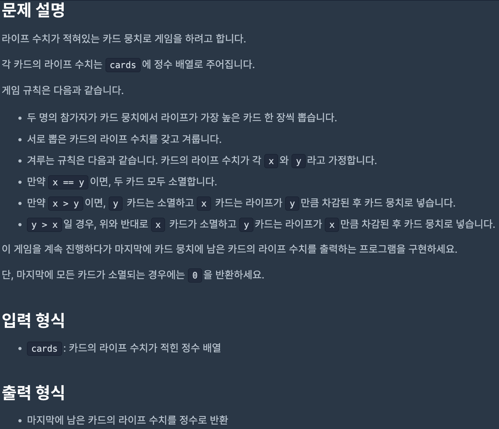
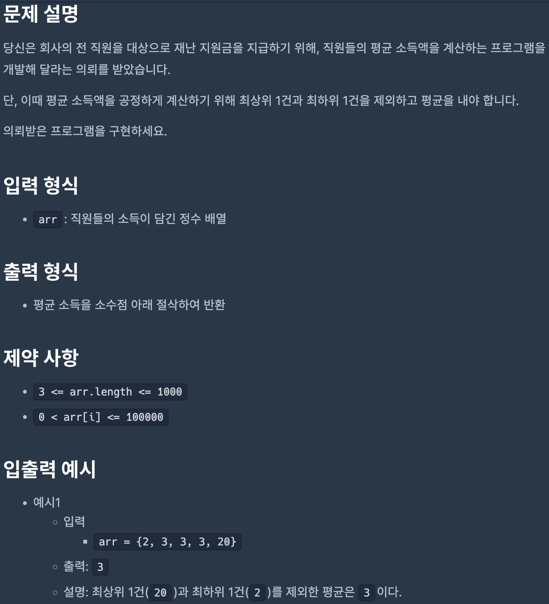
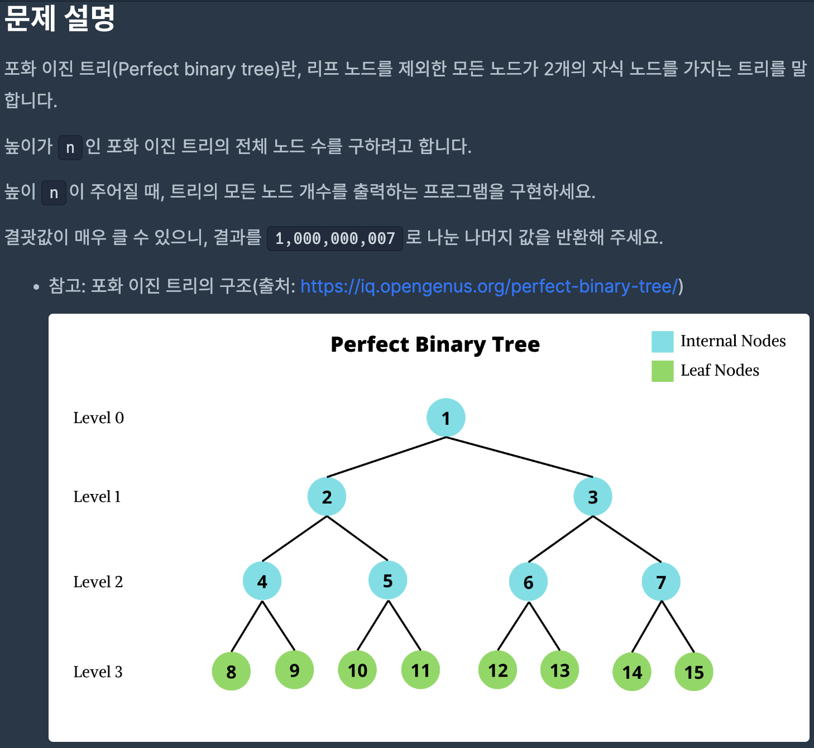
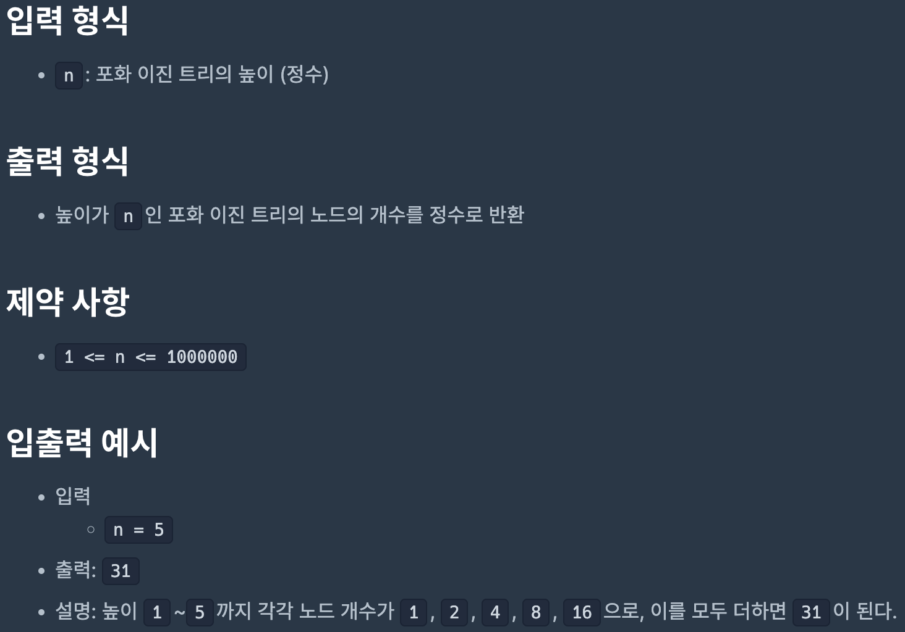
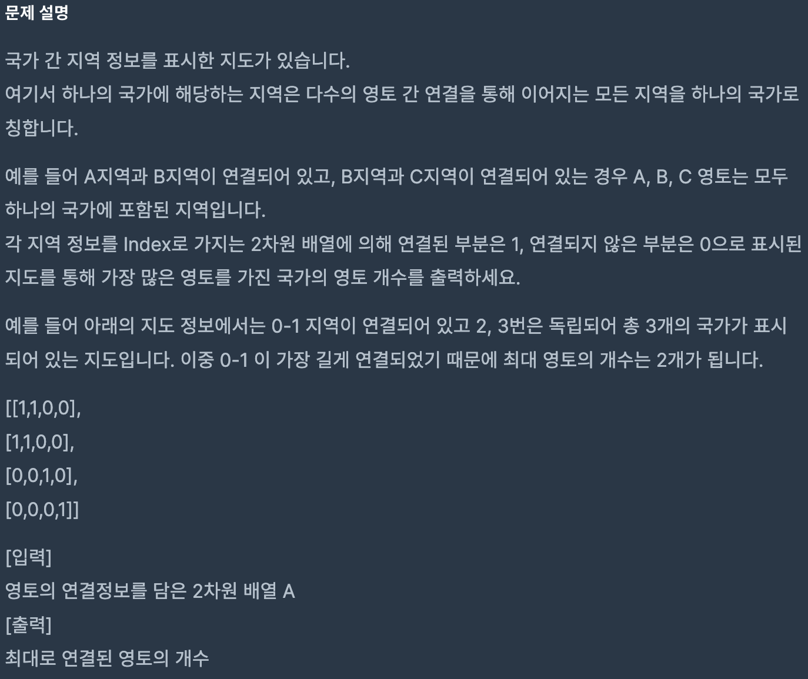
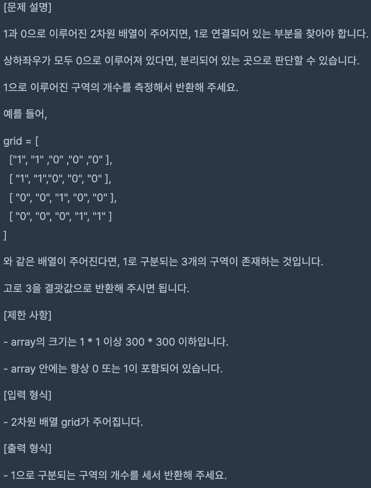

# Coding Test 10

<br>

## Problem 1



### Solution

```javascript
function solution(cards) {
    cards.sort((x, y) => y - x);

    while (cards.length > 1) {
        const newCard = cards[0] - cards[1];
        if (newCard === 0) {
            cards.splice(0, 2);
        } else {
            cards.splice(0, 2, newCard);
            cards.sort((x, y) => y - x);
        }
    }

    if (cards[0]) return cards[0];

    return 0;
}
```

[Link to my JavaScript solution file](./T10P1.js)

<br>

## Problem 2



### Solution

```javascript
function solution(arr) {
    arr.sort((x, y) => x - y);
    arr.pop();
    arr.shift();

    const avg = Math.floor(arr.reduce((a, c) => a + c) / arr.length);

    return avg;
}
```

[Link to my JavaScript solution file](./T10P2.js)

<br>

## Problem 3




### Solution

```javascript
function solution(n) {
    let answer = Math.pow(2, n) - 1;
    answer %= 1000000007;

    return Math.round(answer);
}
```

[Link to my JavaScript solution file](./T10P3.js)

<br>

## Problem 4



### Solution

```javascript
function solution(A) {
    let maxCnt = 0,
        currCnt = 1,
        prevIdx = [];

    for (let i = 0; i < A.length; i++) {
        const currIdx = [];

        for (let j = 0; j < A[i].length; j++) {
            if (A[i][j] === 1) currIdx.push(j);
        }

        const connected = currIdx.some((i) => prevIdx.includes(i));

        if (connected) {
            currCnt++;
        } else {
            maxCnt = Math.max(maxCnt, currCnt);
            currCnt = 1;
        }

        prevIdx = currIdx;
    }

    return maxCnt;
}
```

[Link to my JavaScript solution file](./T10P4.js)

<br>

## Problem 5



### Solution

```javascript
function solution(grid) {
    let count = 1;
    const area = [];

    for (let i = 0; i < grid.length; i++) {
        for (let j = 0; j < grid[i].length; j++) {
            if (grid[i][j] === '1') {
                area.push([i, j]);
            }
        }
    }

    for (let i = 1; i < area.length; i++) {
        if (
            area[i].includes(area[i - 1][0]) ||
            area[i].includes(area[i - 1][1])
        ) {
            continue;
        } else {
            count++;
        }
    }

    return count;
}
```

[Link to my JavaScript solution file](./T10P5.js)

<br>
