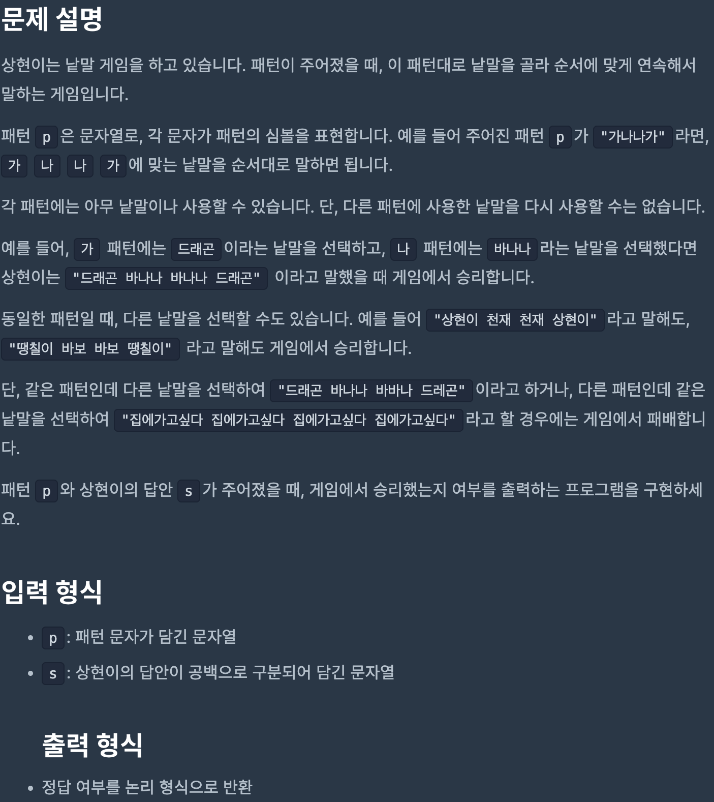
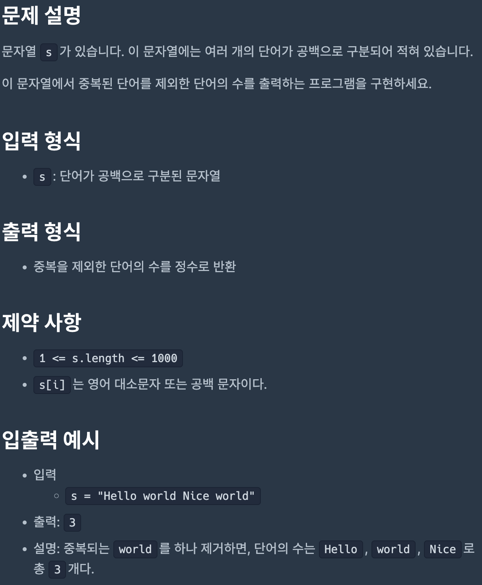
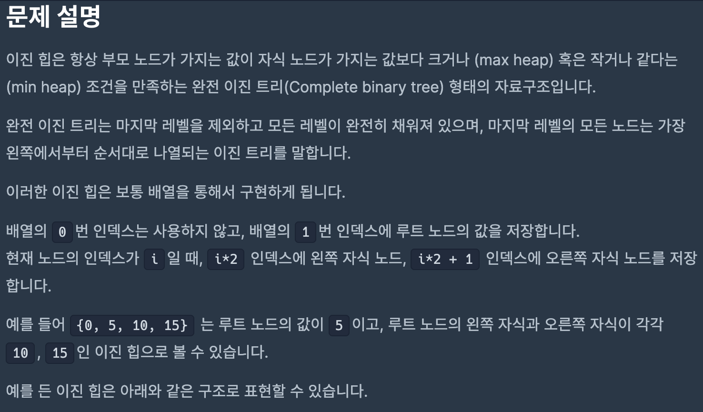
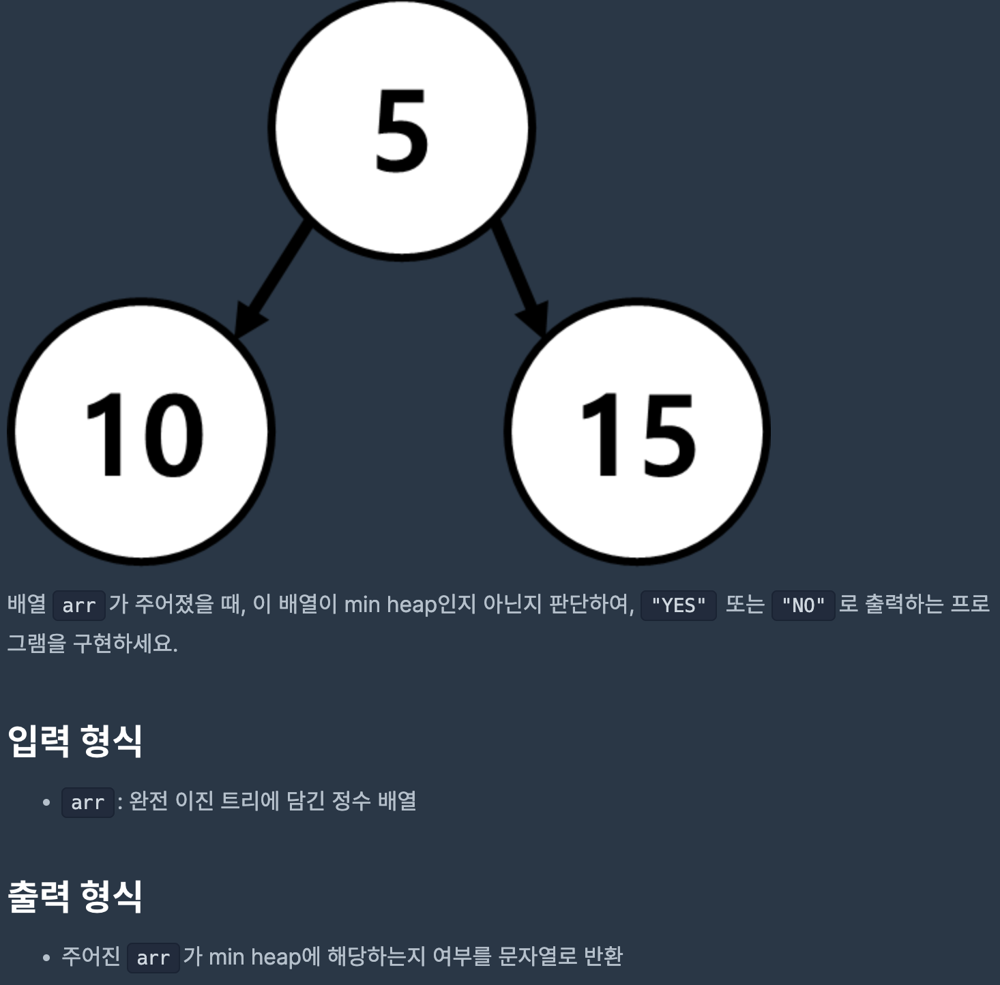
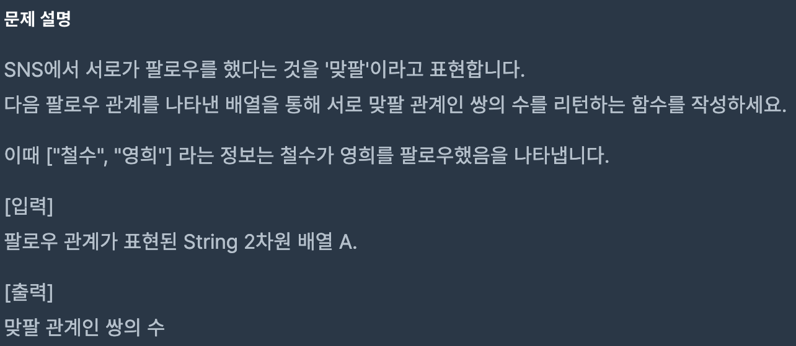

# Coding Test 11

<br>

## Problem 1



### Solution

```javascript
function solution(p, s) {
    const pattern = p.split('');
    const string = s.split(' ');
    const dict = {};

    if (pattern.length !== string.length) {
        return false;
    }

    for (let i = 0; i < pattern.length; i++) {
        const a = pattern[i];
        const b = string[i];

        if (dict[a] && dict[a] === b && dict[b] && dict[b] === a) {
            continue;
        } else if (dict[a] || dict[b]) {
            return false;
        } else {
            dict[a] = b;
            dict[b] = a;
        }
    }

    return true;
}
```

[Link to my JavaScript solution file](./T11P1.js)

<br>

## Problem 2



### Solution

```javascript
function solution(s) {
    return new Set(s.split(' ')).size;
}
```

[Link to my JavaScript solution file](./T11P2.js)

<br>

## Problem 3


### Solution

```javascript
function solution(arr1, arr2) {
    const answer = arr1.filter((n) => arr2.includes(n));
    answer.sort((x, y) => x - y);

    return answer;
}
```

[Link to my JavaScript solution file](./T11P3.js)

<br>

## Problem 4




### Solution

```javascript
function solution(arr) {
    for (let i = 1; i < arr.length / 2; i++) {
        if (arr[i] > arr[i * 2] || arr[i] > arr[i * 2 + 1]) {
            return 'NO';
        }
    }
    return 'YES';
}
```

[Link to my JavaScript solution file](./T11P4.js)

<br>

## Problem 5



### Solution

```javascript
function solution(A) {
    let answer = 0;
    const graph = {};

    for (let i = 0; i < A.length; i++) {
        const personA = A[i][0];
        const personB = A[i][1];

        if (graph[personB] && graph[personB].includes(personA)) {
            answer++;
        } else {
            if (graph[personA]) {
                graph[personA] = graph[personA].concat(personB);
            } else {
                graph[personA] = [personB];
            }
        }
    }

    return answer;
}
```

[Link to my JavaScript solution file](./T11P5.js)

<br>
