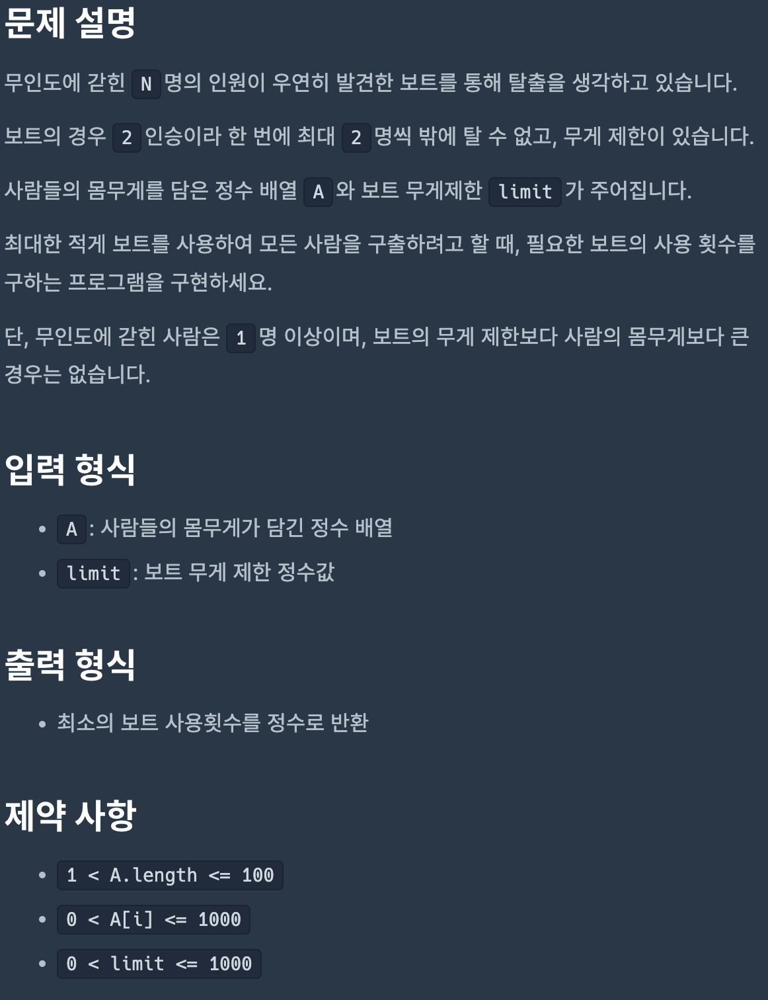
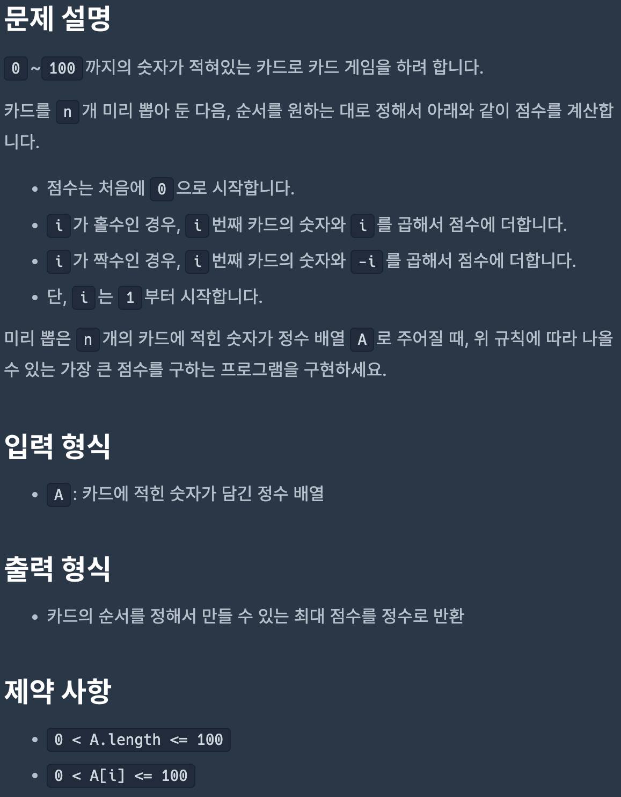
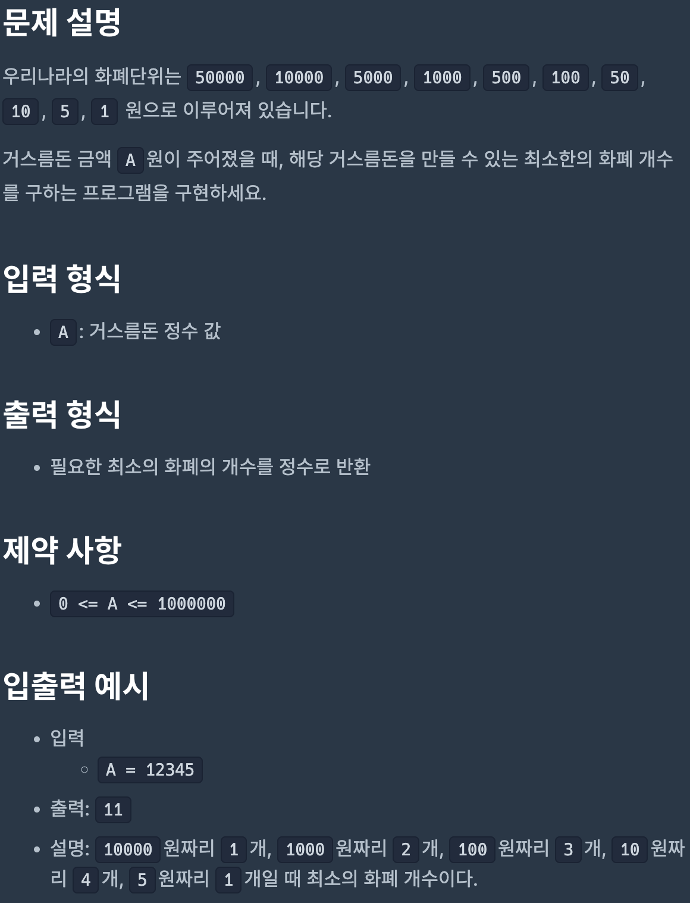
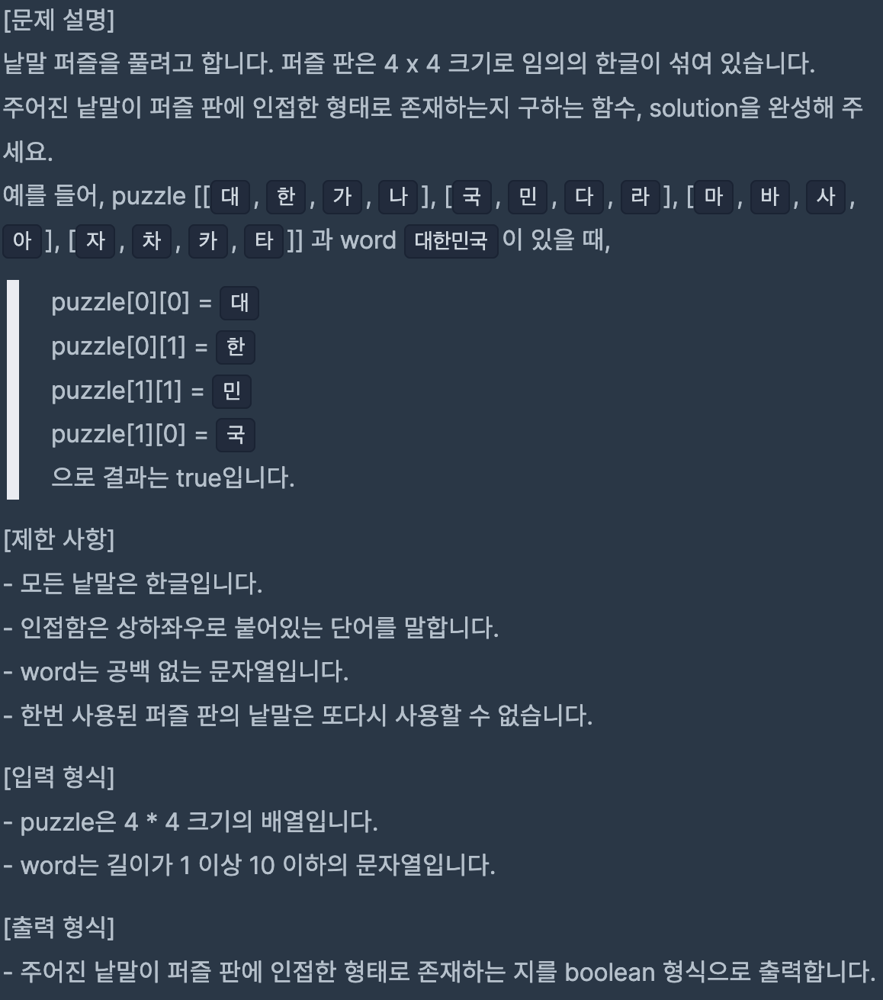
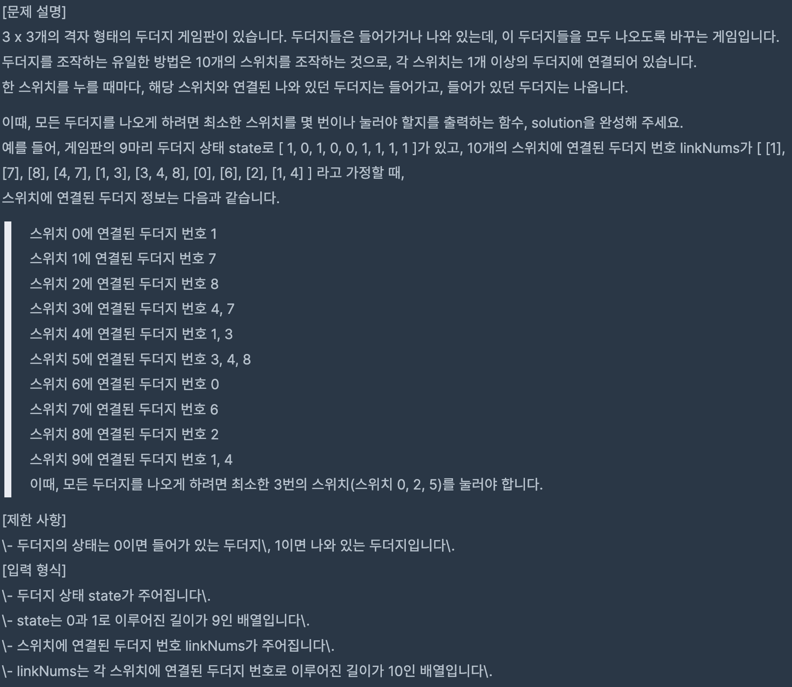

# Coding Test 12

<br>

## Problem 1



### Solution

```javascript
function solution(A, limit) {
    let answer = 0,
        value,
        idx;

    while (A.length > 0) {
        const current = A[0];
        A.shift();

        const arr = A.filter((e) => e <= limit - current);

        if (arr.length > 1) {
            value = arr.sort((x, y) => y - x)[0];
        } else if (arr.length === 1) {
            value = arr[0];
        } else {
            value = null;
        }

        idx = A.findIndex((e) => e === value);
        idx && A.splice(idx, 1);

        answer++;
    }

    return answer;
}
```

[Link to my JavaScript solution file](./T12P1.js)

<br>

## Problem 2



### Solution

```javascript
function solution(A) {
    let idx = Math.ceil(A.length / 2),
        answer = 0;
    A.sort((x, y) => x - y);

    for (let i = 1; i <= A.length; i++) {
        if (i % 2) {
            answer += parseInt(A[idx - 1]) * i;
            idx += i * -1;
        } else {
            answer += parseInt(A[idx - 1]) * i * -1;
            idx += i;
        }
    }

    return answer;
}
```

[Link to my JavaScript solution file](./T12P2.js)

<br>

## Problem 3



### Solution

```javascript
function solution(A) {
    let answer = 0;
    const arr = A.toString().split('');

    for (let i = 0; i < arr.length; i++) {
        let value = parseInt(arr[i]);

        if (value >= 5) {
            value -= 5;
            answer++;
        }

        while (value > 0) {
            value--;
            answer++;
        }
    }

    return answer;
}
```

[Link to my JavaScript solution file](./T12P3.js)

<br>

## Problem 4



### Solution

```javascript
function solution(puzzle, word) {
    const wordArr = word.split('');
    const idxArr = [];

    for (let i = 0; i < wordArr.length; i++) {
        puzzle.forEach((arr, y) =>
            arr.forEach((e, x) => {
                if (e === wordArr[i]) idxArr.push([y, x]);
            })
        );
    }

    for (let i = 0; i < idxArr.length - 1; i++) {
        const current = idxArr[i];
        const next = idxArr[i + 1];
        if (current[0] !== next[0] && current[1] !== next[1]) {
            return false;
        }
    }

    return true;
}
```

[Link to my JavaScript solution file](./T12P4.js)

<br>

## Problem 5



### Solution

```javascript
function solution(state, linkNums) {
    const moleIn = [],
        moleOut = [],
        candidate = [];

    for (let i = 0; i < state.length; i++) {
        state[i] === 1 ? moleOut.push(i) : moleIn.push(i);
    }

    // for (let i = 0; i < linkNums.length; i++) {
    //     const arr = moleIn.filter(n => linkNums[i].includes(n));
    //     if (arr.length === 0) {
    //         continue;
    //     }

    //     if (arr.length === linkNums[i].length) {
    //         candidate.push(i);
    //     } else {
    //         const others = linkNums[i].filter(n => !arr.includes(n));
    //     }
    // }

    return 3;
}
```

[Link to my JavaScript solution file](./T12P5.js)

<br>
